<style>
  /* if you want to use custom theme, type custom-theme instead of theme global directive in the header or change location in url */
  @import url("custom-theme.css"); 
</style>

<style>

  .grid-code-block {
    display: grid;
    grid-template-columns: 1fr 1fr;
  }

  .code-block {
    display: block;
    position: relative;
  }

</style>

<!-- _footer: Gymnázium, Veľká Okružná 22, Žilina -->
<!-- _header: Marek Kuchar -->
# Raytracing
---

<style>
  section {
    font-size: 30px;
  }
</style>
# Čo je to Ray Tracing?

- Ray Tracing
  - rendering technika, ktorá iluminuje svetlo na generovanie realistických obrázkov
- Prečo Ray Tracing?
  - využívaný vo veľa odvetviach ako napríklad filmy, videohry alebo dizajn
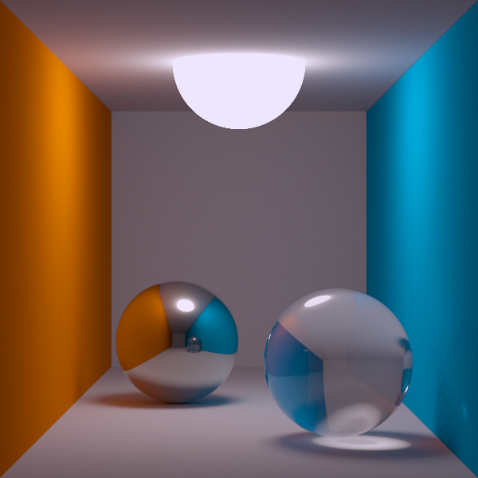

---

<style scoped>
  h1 {
    position: absolute;
    margin-left: 0;
    margin-top: -200px;
  }
</style>
<!-- 
Realistická vizualizácia (CAD)
-->
# Ukážka #1

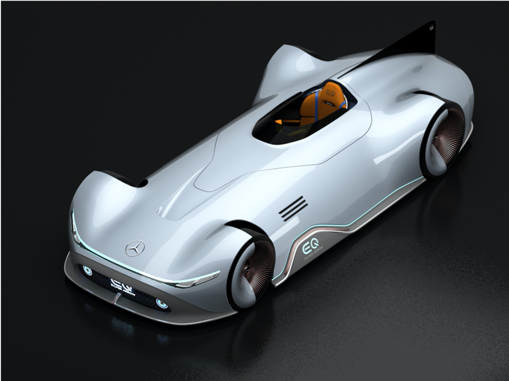

---

<style scoped>
  h1 {
    position: absolute;
    margin-left: 0;
    margin-top: 200px;
  }
</style>
<!-- 
Fyzikalne modely
-->
# Ukážka #2

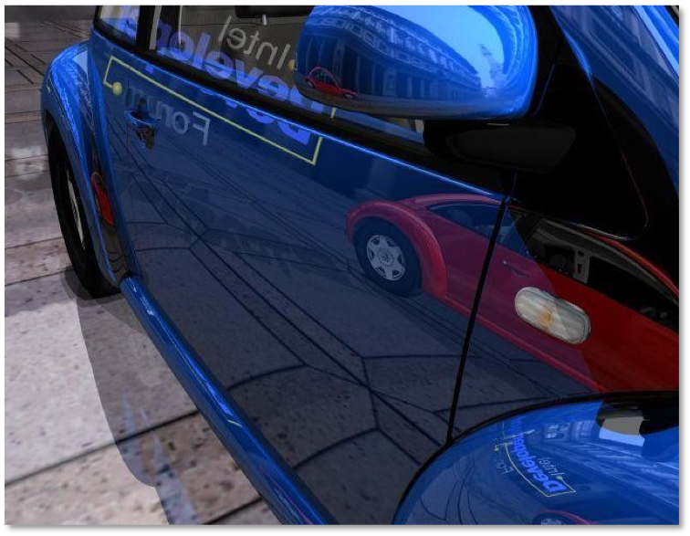

---


<style scoped>
  h1 {
    position: absolute;
    margin-left: 750px;
    margin-top: -200px;
  }
</style>
<!-- 
Hry
-->
# Ukážka #3

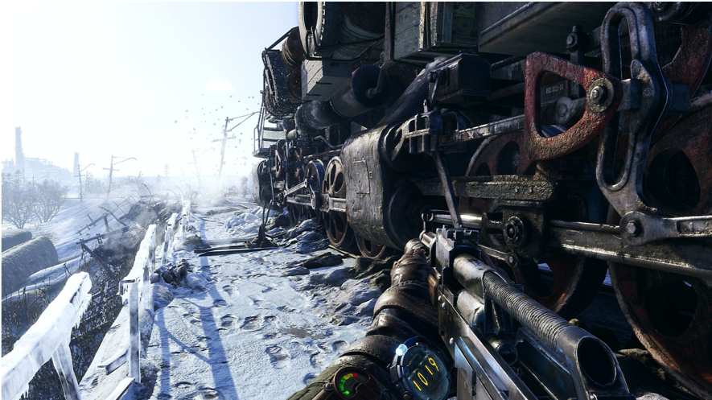

---

<style scoped>
  h1 {
    position: absolute;
    margin-left: 750px;
    margin-top: 200px;
  }
</style>
<!-- 
Simulacia svetla
-->
# Ukážka #4

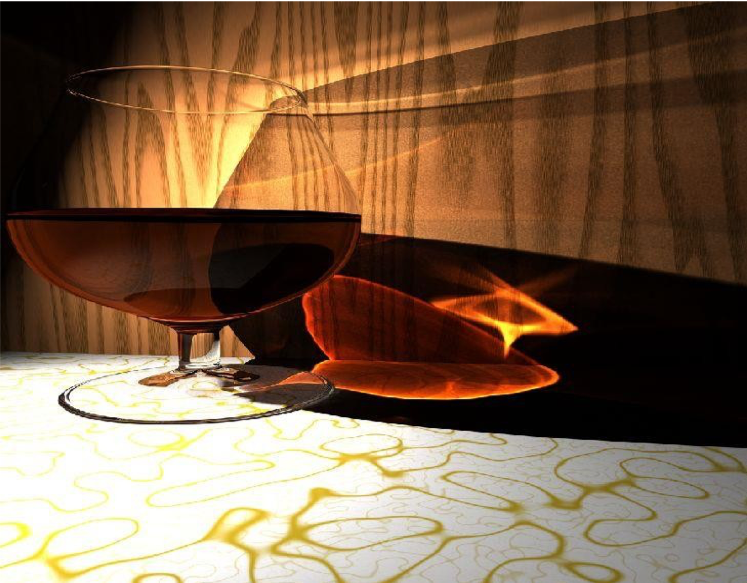

---

# Ray Tracing základy #1

- Generovanie lúčov (Ray generation)
  - pre každý pixel
  - vysielané do scény pozdĺž smeru kamery
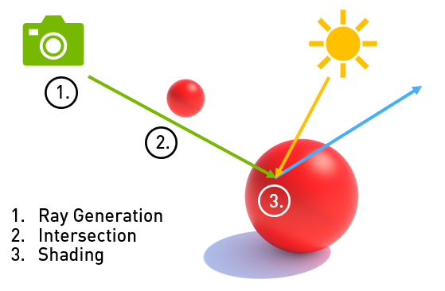

---

# Ray Tracing základy #2

- Intersekcia lúčov (Ray intersection)
  - skontroluje pretínanie lúča a geometrie scény
  - ňalgoritmy pre väčšinu geometrických "primitives" boli vyvinuté v roku 1990


---

# Ray Tracing základy #3

- Tieňovanie (Shading)


---

# ????

  <style scoped>
    code {
      font-size: 150%;
    }
  </style>
  <div class="code-block">

  ```cpp
    m_pBrush->SetColor(D2D1::ColorF(255, 255, 255, 255));
    D2D1_RECT_F rect = {};
    rect.bottom = (float)height/ 2 + 25.0f;
    rect.top    = (float)height/ 2 - 25.0f;
    rect.right  = (float)width / 2 - 25.0f;
    rect.left   = (float)width / 2 + 25.0f;
    m_pRenderTarget->FillRectangle(rect, m_pBrush);
  ```

  </div>

---

# ????

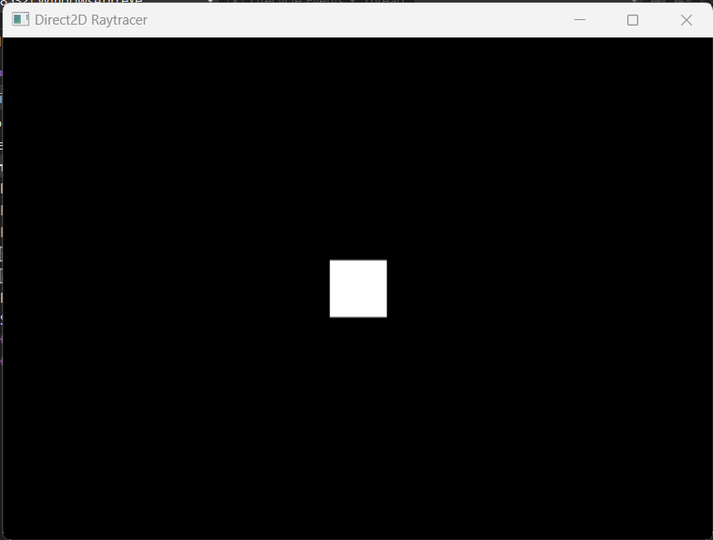

---

# ????

  <style scoped>
    code {
      font-size: 150%;
    }
  </style>
  <div class="code-block">

  ```cpp
    m_pBrush->SetColor(D2D1::ColorF(255, 255, 255, 255));
    D2D1_RECT_F rect = {};
    rect.bottom = (float)height/ 2 + 25.0f;
    rect.top    = (float)height/ 2 - 25.0f;
    rect.right  = (float)width / 2 - 25.0f;
    rect.left   = (float)width / 2 + 25.0f;
    m_pRenderTarget->FillRectangle(rect, m_pBrush);

    m_pBrush->SetColor(D2D1::ColorF(255, 0, 0, 255));
    D2D1_RECT_F rect2 = {};
    rect2.bottom = (float)height/ 2 + 25.0f;
    rect2.top    = (float)height/ 2 - 25.0f;
    rect2.right  = (float)width / 2 - 25.0f;
    rect2.left   = (float)width / 2 + 25.0f;
    m_pRenderTarget->FillRectangle(rect2, m_pBrush);
  ```

  </div>

---

# ????

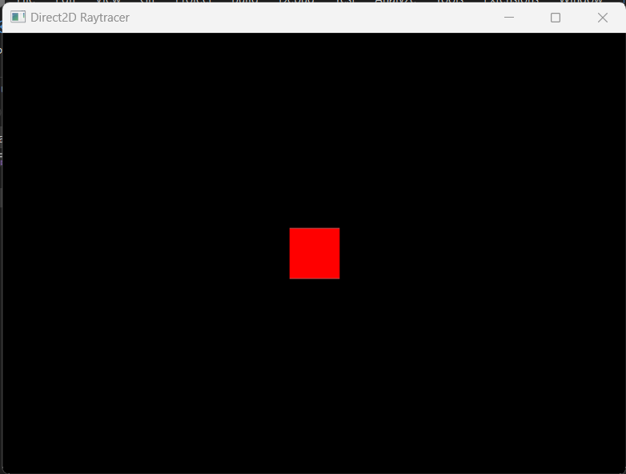

---

# Z-Buffering

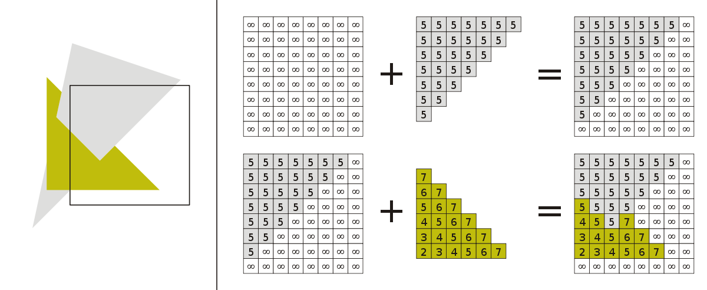

---

# Ray Tracing

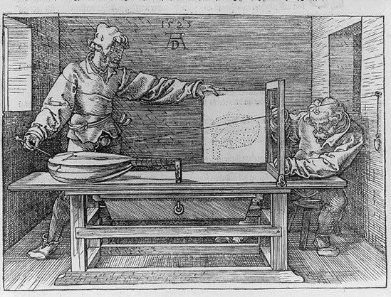

---

# Začíname!

  <style scoped>
    .grid-code-block {
      grid-template-columns: 2fr 1fr;
    }
  </style>
  <div class="grid-code-block">

  <div class="code-block">

  ```cpp
  int main() {
    // Image
    const int image_width = 256;
    const int image_height = 256;
    // Render
    std::cout << "P3\n" << image_width << ' ' << image_height << "\n255\n";
    for (int j = image_height-1; j >= 0; --j) {
      for (int i = 0; i < image_width; ++i) {
        double r = double(i) / (image_width-1);
        double g = double(j) / (image_height-1);
        double b = 0.25;

        int ir = static_cast<int>(255.999 * r);
        int ig = static_cast<int>(255.999 * g);
        int ib = static_cast<int>(255.999 * b);

        std::cout << ir << ' ' << ig << ' ' << ib << '\n';
      }
    }
  }
  ```

  </div>

  <style scoped>
    pre {
      font-size: 115%;
    }
  </style>
  <div class="code-block">

  ```cpp
  P3
  256 256
  255
  0 255 63
  1 255 63
  2 255 63
  3 255 63
  4 255 63
  5 255 63
  6 255 63
  7 255 63
  8 255 63
  9 255 63
  ...
  ```

  </div>

---

# Začíname!

  <style scoped>
    .grid-code-block {
      grid-template-columns: 2fr 1fr;
    }
  </style>
  <div class="grid-code-block">

  <div class="code-block">

  ```cpp
  int main() {
    // Image
    const int image_width = 256;
    const int image_height = 256;
    // Render
    std::cout << "P3\n" << image_width << ' ' << image_height << "\n255\n";
    for (int j = image_height-1; j >= 0; --j) {
      for (int i = 0; i < image_width; ++i) {
        double r = double(i) / (image_width-1);
        double g = double(j) / (image_height-1);
        double b = 0.25;

        int ir = static_cast<int>(255.999 * r);
        int ig = static_cast<int>(255.999 * g);
        int ib = static_cast<int>(255.999 * b);

        std::cout << ir << ' ' << ig << ' ' << ib << '\n';
      }
    }
  }
  ```

  </div>

  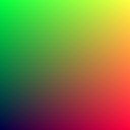

---

# Vektory?

  <style scoped>
    .grid-code-block {
      grid-template-columns: 1.5fr 1fr;
    }
  </style>
  <div class="grid-code-block">

  <style scpped>
    .code-block {
      margin-left: 10px;
    }
  </style>
  <div class="code-block">

  ```cpp
    class vec3 {
      public:
        vec3(double e0, double e1, double e2) : e{e0, e1, e2} {}

        double x() const { return e[0]; }
        double y() const { return e[1]; }
        double z() const { return e[2]; }

        vec3& operator+=(const vec3& v) {
            e[0] += v.e[0];
            e[1] += v.e[1];
            e[2] += v.e[2];
            return *this;
        }
        vec3& operator-=(const vec3& v);
        vec3& operator*=(const vec3& v);
        vec3& operator/=(const vec3& v);

      private:
        double e[3];
    };
  ```

  </div>

  <div class="code-block">

  ```cpp

    vec3 moj_vektor { 0.0, 1.1., 2.2 };
    moj_vektor.x() = 1.1; // e = { 1.1, 1.1, 2.2 }

    vec3 moj_2_vektor { 0.0, 0.0, 1.1 };
    moj_vektor += moj_2_vektor; // e = { 1.1, 1.1, 3.3 }

    using point3 = vec3;
    using color  = vec3;

  ```

  </div>

---

# Vektory?

  <div class="grid-code-block">

  <div class="code-block">

  ```cpp
  color rgb {
    double(i) / (image_width - 1), // r
    double(j) / (image_height - 1), // g
    0.25 // b
  };
  ```

  </div>

  <div class="code-block">

  ```cpp
  double r = double(i) / (image_width-1);
  double g = double(j) / (image_height-1);
  double b = 0.25;
  ```

  </div>

---

# Ray

  <style scoped>
    .grid-code-block {
      grid-template-columns: 1.5fr 1fr;
    }
  </style>
  <div class="grid-code-block">

  <style scoped>
    .code-block {
      font-size: 150%;
    }
  </style>
  <div class="code-block">

  ```cpp
  class ray {
    public:
        ray(const point3& origin, const vec3& direction)
            : orig(origin), dir(direction)
        {}

        point3 origin() const  { return orig; }
        vec3 direction() const { return dir; }

        point3 at(double t) const {
            return orig + t*dir;
        }

    private:
        point3 orig;
        vec3 dir;
  };
  ```

  </div>

  <div class="code-block">

  ```cpp
  point3 IJ = { i, j, 0.0 };
  point3 origin { 0.0, 0.0, 0.0 };
  vec3 direction = IJ;

  ray r(origin, direction);
  ```

  </div>


---

# Geometria kamery 
---

#

  

---

# Kamera

  ```cpp
  // Image
  const auto aspect_ratio = 16.0 / 9.0;
  const int image_width = 400;
  const int image_height = static_cast<int>(image_width / aspect_ratio);

  // Camera
  ?????
  ```

---

# Kamera

  <div class="grid-code-block">

  <div class="code-block">
  
  ```cpp
  struct CAM_DESCRIPTOR {
		double aspect_ratio = 16.0 / 9.0;
		double viewport_height = 2.0;
		double focal_length = 1.0;
		double viewport_width = aspect_ratio * viewport_height;

		vec3 horizontal = vec3{ viewport_width, 0.0, 0.0 };
		vec3 vertical = vec3{ 0.0, viewport_height, 0.0 };
		point3 origin = point3{ 0.0, 0.0, 0.0 };
		point3 lower_left_corner = origin - horizontal / 2 - vertical / 2 
          - vec3{ 0.0, 0.0, focal_length };
	};
  ```

  </div>

  <div class="code-block">

  

  </div>

---


# Kamera

  <style scoped>
    .grid-code-block {
      grid-template-columns: 1fr 2fr;
    }
  </style>
  <div class="grid-code-block">

  <div class="code-block">

  ```cpp
  // Image
  const auto aspect_ratio = 16.0 / 9.0;
  const int image_width = 400;
  const int image_height = static_cast<int>(
    image_width / aspect_ratio);
  // Camera
  raytracer::CAM_DESCRIPTOR camd;
  ```

  </div>

  <div class="code-block">

  ```cpp
  struct CAM_DESCRIPTOR {
    double aspect_ratio = 16.0 / 9.0;
    double viewport_height = 2.0;
    double focal_length = 1.0;
    double viewport_width = aspect_ratio * viewport_height;

    vec3 horizontal = vec3{ viewport_width, 0.0, 0.0 };
    vec3 vertical = vec3{ 0.0, viewport_height, 0.0 };
    point3 origin = point3{ 0.0, 0.0, 0.0 };
    point3 lower_left_corner = origin - horizontal / 2 - vertical / 2 
        - vec3{ 0.0, 0.0, focal_length };
};
  ```

  </div>

---

# Kamera

  ```cpp
  color ray_color(const ray& r) {
    vec3 unit_direction = unit_vector(r.direction());
    auto t = 0.5*(unit_direction.y() + 1.0);
    return (1.0-t)*color(1.0, 1.0, 1.0) + t*color(0.5, 0.7, 1.0);
  }
  ```

---

<style scoped>
  h1 {
    color: black;
  }
</style>
# Kamera


---

# Sféry

  <div class="grid-code-block">

  <div class="code-block">

  ```cpp
  bool hit_sphere(
    const point3& center,
    double radius,
    const ray& r
  ) {
    vec3 oc = r.origin() - center;
    auto a = dot(r.direction(), r.direction());
    auto b = 2.0 * dot(oc, r.direction());
    auto c = dot(oc, oc) - radius*radius;
    auto discriminant = b*b - 4*a*c;
    return (discriminant > 0);
  }
  ```

  </div>


  <div class="code-block">

  ```cpp
  color ray_color(const ray& r) {
    if (hit_sphere(
        {0,0,-1},
        0.5,
        r)
    ) {
      return color(1, 0, 0);
    }
    vec3 unit_direction = unit_vector(r.direction());
    auto t = 0.5*(unit_direction.y() + 1.0);
    return 
      (1.0-t)*color(1.0, 1.0, 1.0)
      + t*color(0.5, 0.7, 1.0);
  }
  ```

  </div>

<style scoped>
  p {
    text-align: center;
  }
</style>
$$
\begin{align*}
\text{G}(S_g, R_g) : S_g = [a, b, c] \quad r = R_g \\
(x - a)^2 + (y - b)^2 + (z - c)^2 = r^2
\end{align*}
$$

---

#


---

#


---

#


---

#

```cpp
for (int j = image_height-1; j >= 0; --j) {
  for (int i = 0; i < image_width; ++i) {
      //...
      for (int s = 0; s < samples_per_pixel; ++s) {
          auto u = (i + random_double()) / (image_width-1);
          auto v = (j + random_double()) / (image_height-1);
          //...
          pixel_color += ray_color(r, world);
      }
      //...
  }
}
```

---

<style scoped>
  h1 {
    color: black;
    position: absolute;
    margin-top: -540px;
  }
</style>
# Problémy?


---

<style scoped>
  h1 {
    margin-top: 0px;
    margin-bottom: 580px;
  }
</style>
# Problémy?

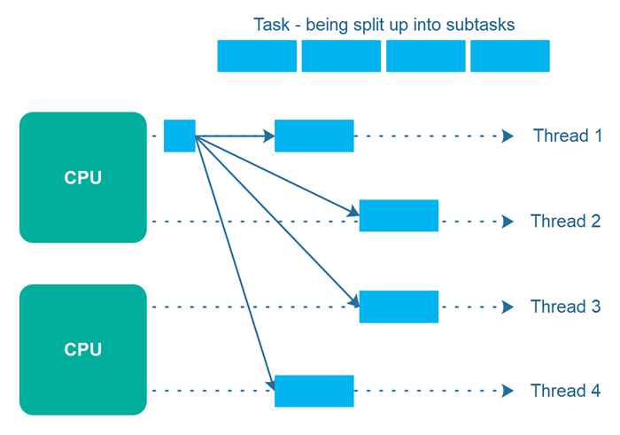

---

<style scoped>
  h1 {
    margin-top: 0px;
    margin-bottom: 580px;
  }
</style>
# Problémy?

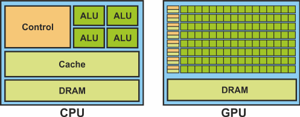

---

# Problémy?

spôsob | 10 run-ov | 1 run
-----:|-----:|-----:
ST | >60min | >360'000ms
FUTURE | 11min7s | 66'572.7ms
OMP | 15min11s | 91'038ms

---

# Riešenia?

-  <b>OpenCL</b> (Cross-X)
-  <b>SYCL</b> (<i>ževraj</i> Cross-X...)
-  <b>Embree</b> (Intel)
-  <b>HIP</b> (AMD)/ <b>CUDA</b> (NVIDIA)
---

<style scoped>
  pre {
    font-size: 120%;
  }
</style>
# Začíname!
  ```cpp
  #include <embree4/rtcore.h>

  /* MAGIC */

  int main() {
    raytracer::HRTCDevice hdevice;
    raytracer::HRTCScene  hscene(hdevice, GEOMETRY_CUSTOM | GEOMETRY_CUSTOM_SPHERE);

    castRay(scene, 0.33f, 0.33f, -1, 0, 0, 1);
    castRay(scene, 1f, 1f, -1, 0, 0, 1);

    rtcReleaseScene(scene);
    rtcReleaseDevice(device);
  }
  ```
---

<style scoped>
  pre {
    font-size: 120%;
  }
</style>
# Device
```cpp
struct HRTCDevice {
public:
  //constructor
  HRTCDevice(const char* config = nullptr) {
    m_device = deviceInit(config);
  }
  //destructor
  ~HRTCDevice() {
    rtcReleaseDevice(m_device);
  }
  //accessor
  RTCDevice& getDevice() { return m_device; }
private:
  //member data
  RTCDevice m_device;
};
```
---

<style scoped>
  pre {
    font-size: 120%;
  }
</style>
# Device
```cpp
RTCDevice deviceInit(const char* config) {
  RTCDevice device = rtcNewDevice(config);
  if (!device)
    std::cout << "Device not found!\n";

  rtcSetDeviceErrorFunction(device, raytracer::RTCErrorFunction, nullptr);
  return device;
}
```
---

# Scene
```cpp
struct HRTCScene {
public:
  //constructor
  HRTCScene(RTCDevice device, unsigned int gflags)
    : m_scene{}, m_gflags(gflags) {
    m_scene = sceneInit(device, gflags);
  }
  HRTCScene(HRTCDevice device, unsigned int gflags)
    : m_scene{}, m_gflags(gflags) {
    m_scene = sceneInit(device.getDevice(), gflags);
  }
  //destructor
  ~HRTCScene() {
    rtcReleaseScene(m_scene);
  }
  //accessor
  RTCScene& getScene() { return m_scene; }
private:
  //member data
  RTCScene m_scene;
  unsigned int m_gflags;
};
```
---

<style>
  pre {
    font-size: 120%;
  }
</style>
# Scene
```cpp
RTCScene sceneInit(
  RTCDevice& device, unsigned int gflags) {
  RTCScene scene = rtcNewScene(device);

  if (gflags & GEOMETRY_PREDEFINED) {
    rtcNewGeometry();

    /* MAGIC */

    rtcCommitGeometry(...);
    rtcAttachGeometry(...);
    rtcReleaseGeometry(...);
  }

  if (gflags & GEOMETRY_CUSTOM) {
    if (gflags & GEOMETRY_CUSTOM_SPHERE) {
      rtcNewGeometry(...);

      /* MAGIC */

      rtcSetGeometryUserPrimitiveCount(...);
      rtcSetGeometryUserData(...);

      rtcSetGeometryBoundsFunction(...);
      rtcSetGeometryIntersectFunction(...);
      rtcSetGeometryOccludedFunction(...);

      rtcCommitGeometry(...);
      rtcAttachGeometry(...);
      rtcReleaseGeometry(...);
    }
  }

  rtcCommitScene(...);
  return scene;
}
```
---

<style>
  pre {
    font-size: 120%;
  }
</style>
# sphere
```cpp
struct sphere {
  float3 sphere_center;
  float  sphere_radius;
  unsigned int geomID;
};
```
---

# void RTCBoundsFunction(const struct RTCBoundsFunctionArgs*)
---

```cpp
void RTCBoundsFunction(const struct RTCBoundsFunctionArguments* args) {
  RTCBounds* bounds_o = args->bounds_o;
  const sphere* spheres = reinterpret_cast<sphere*>(args->geometryUserPtr);
  const sphere sp = spheres[args->primID];
  // Compute the bounds of the sphere here and store it in 'bounds_o'
  // Define a center
  float3 center = sp.sphere_center;
  // Define a radius
  float r = sp.sphere_radius;
  bounds_o->lower_x = center.x() - r;
  bounds_o->lower_y = center.y() - r;
  bounds_o->lower_z = center.z() - r;

  bounds_o->upper_x = center.x() + r;
  bounds_o->upper_y = center.y() + r;
  bounds_o->upper_z = center.z() + r;
}
```
---

# void RTCIntersectFunctionN(const struct RTCIntersectFunctionNArguments*)

---
```cpp
void RTCIntersectFunctionN(const struct RTCIntersectFunctionNArguments* args) {
  RTCRayHit* rayhit = (RTCRayHit*)args->rayhit;
  RTCRay* ray = &rayhit->ray;
  //RTCHit hit = rayhit->hit; SHOULD NOT BE READ!
  const sphere* spheres = reinterpret_cast<sphere*>  (args->geometryUserPtr);
  const sphere& sp = spheres[args->primID];
  const int N = args->N; // ray packed size, should be 1
  int* valid = args->valid;
  
  if (N != 1) { abort(); }
  if (!valid[0]) { return; }
  valid[0] = 0;
  
  // Get sphere data
  float3 sphereCenter = /*sp.sphere_center*/make_float3  (400.f, 300.f, 0.f);
  const float sphereRadius = /*sp.sphere_radius*/10.f;
  
  // Compute the vector from ray origin to sphere center
  float3 oc = {
    ray->org_x - sphereCenter.x(),
    ray->org_y - sphereCenter.y(),
    ray->org_z - sphereCenter.z()
  };
  
  // Compute the quadratic coefficients
  float3 dir3 = { ray->dir_x, ray->dir_y, ray->dir_z };
  const float a = dot(dir3, dir3);
  const float b = 2.0f * dot(oc, dir3);
  const float c = dot(oc, oc) - sphereRadius *   sphereRadius;
  
  // Compute the discriminant
  const float discriminant = b * b - 4.0f * a * c;
  
  if (discriminant >= 0.0f) {
  // Ray intersects the sphere
  const float sqrtDiscriminant = sqrtf(discriminant);
  const float inv2a = 1.0f / (2.0f * a);
  
// Calculate the two solutions for t (intersection   distance)
  float t1 = (-b - sqrtDiscriminant) * inv2a;
  float t2 = (-b + sqrtDiscriminant) * inv2a;
  
  RTCHit potentialHit = {};
  potentialHit.u = 0.0f;
  potentialHit.v = 0.0f;
  std::memcpy(potentialHit.instID, args->context, 1);
  potentialHit.geomID = 1;
  potentialHit.primID = args->primID;
  
  if ((ray->tnear < t1) && (t1 < ray->tfar)) {
    float t = t1;
  
  potentialHit.Ng_x = ray->org_x + t * ray->dir_x - sp.  sphere_center.x();
  potentialHit.Ng_y = ray->org_y + t * ray->dir_y - sp.  sphere_center.y();
  potentialHit.Ng_z = ray->org_z + t * ray->dir_z - sp.  sphere_center.z();
  
    RTCFilterFunctionNArguments ffnargs = {};
    ffnargs.valid = (int*)-1;
    ffnargs.geometryUserPtr = args->geometryUserPtr;
    ffnargs.context = args->context;
    ffnargs.ray = (RTCRayN*)args->rayhit;
    ffnargs.hit = (RTCHitN*)&potentialHit;
    ffnargs.N = 1;
  
    ray->tfar = t;
    rtcInvokeIntersectFilterFromGeometry(args, &ffnargs);
  
    rayhit->hit = potentialHit;
    valid[0] = -1;
  }
  
  if ((ray->tnear < t2) && (t2 < ray->tfar))
  {
    float t = t2;
  
    potentialHit.Ng_x = ray->org_x + t * ray->dir_x - sp.  sphere_center.x();
    potentialHit.Ng_y = ray->org_y + t * ray->dir_y - sp.  sphere_center.y();
    potentialHit.Ng_z = ray->org_z + t * ray->dir_z - sp.  sphere_center.z();
  
    RTCFilterFunctionNArguments ffnargs;
    ffnargs.valid = (int*)-1;
    ffnargs.geometryUserPtr = args->geometryUserPtr;
    ffnargs.context = args->context;
    ffnargs.ray = (RTCRayN*)args->rayhit;
    ffnargs.hit = (RTCHitN*)&potentialHit;
    ffnargs.N = 1;
  
  //rtcInvokeIntersectFilterFromGeometry(args, &  ffnargs);
  
    rayhit->hit = potentialHit;
    valid[0] = -1;
  }
  }
  //If the user-defined primitive is missed
  //by a ray of the ray packet, 
  //the function should return without 
  //modifying the ray or hit
  else {
  /*rayhit.hit.geomID = RTC_INVALID_GEOMETRY_ID;
  rayhit.hit.instID[0] = RTC_INVALID_GEOMETRY_ID;*/
  return;
  }
}
```
---

```cpp
// Get sphere data
float3 sphereCenter = sp.sphere_center;
const float sphereRadius = sp.sphere_radius;

// Compute the vector from ray origin to sphere center
float3 oc = {
  ray->org_x - sphereCenter.x(),
  ray->org_y - sphereCenter.y(),
  ray->org_z - sphereCenter.z()
};

// Compute the quadratic coefficients
float3 dir3 = { ray->dir_x, ray->dir_y, ray->dir_z };
const float a = dot(dir3, dir3);
const float b = 2.0f * dot(oc, dir3);
const float c = dot(oc, oc) - sphereRadius * sphereRadius;

// Compute the discriminant
const float discriminant = b * b - 4.0f * a * c;
```
---

```cpp
if (discriminant >= 0.0f) {
  // Ray intersects the sphere
  const float sqrtDiscriminant = sqrtf(discriminant);
  const float inv2a = 1.0f / (2.0f * a);
  
  // Calculate the two solutions for t (intersection   distance)
  float t1 = (-b - sqrtDiscriminant) * inv2a;
  float t2 = (-b + sqrtDiscriminant) * inv2a;
  
  RTCHit potentialHit = {};
  potentialHit.u = 0.0f;
  potentialHit.v = 0.0f;
  std::memcpy(potentialHit.instID, args->context, 1);
  potentialHit.geomID = 1;
  potentialHit.primID = args->primID;

  // Calculate the closest point and return
  ???????????
}
else {
  return;
}
```
---

```cpp
if((ray->tnear < t1) && (t1 < ray->tfar)) {
  potentialHit.Ng_x = ray->org_x + t * ray->dir_x - sp.sphere_center.x();
  potentialHit.Ng_y = ray->org_y + t * ray->dir_y - sp.sphere_center.y();
  potentialHit.Ng_z = ray->org_z + t * ray->dir_z - sp.sphere_center.z();

  rayhit->hit = potentialHit;
  valid[0] = -1;
}
if((ray->tnear < t2) && (t2 < ray->tfar)) {
  /* sejm : )*/
}
```
---

# Začíname!
  <--!UNDER DEVELOPMENT-->

---